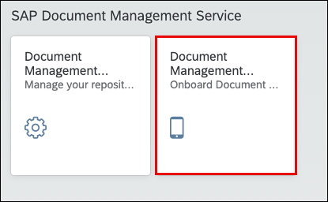
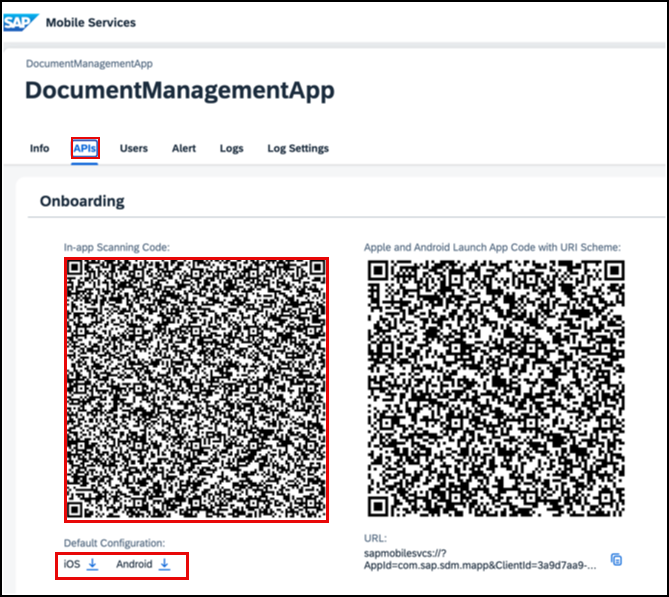

<!-- loio985ec468d7dc4dedb6a0ed583745e5cd -->

# Accessing a QR Code for Mobile Applications

The procedure outlines how to generate a QR code for activating the mobile application.

<a name="loio985ec468d7dc4dedb6a0ed583745e5cd__prereq_dg5_ycx_1bc"/>

## Prerequisites

-   You've subscribed to the Document Management Service, Application Option in the SAP BTP cockpit. For more information about the initial setup, see [Subscribing to Document Management Service, Application Option](https://help.sap.com/docs/document-management-service/sap-document-management-service/subscribing-to-document-management-service-application-option?locale=en-US&version=Cloud).
-   You've added the `SDM_MobileAdmin` role to your account.
-   You've successfully migrated your repositories if you have an existing account and have chosen to move those repositories to your new account. For more information about migration, see [Migrating to SAP Document Management Service](https://help.sap.com/viewer/8e5c8dd3350245848edf216bf176444c/Dev/en-US/2f448be6acf147b4ac3dc2fa0cd5341d.html "This topic describes the steps that you need to follow when migrating from SAP Document Center and Document Service in the Neo environment to SAP Document Management Service. You can also migrate across data centers in SAP Document Management Service.") :arrow_upper_right:.

## Procedure

1.  Log on to the Document Management Service, Application Option admin view.

2.  Click the *Document Management Service Mobile Admin* tile.

    

3.  On the Getting Started page, click *Start Onboarding*.

4.  Click *Mobile Services Cockpit*.

    The SAP Mobile Services cockpit opens in a separate window.

5.  Open the *APIs* tab where you will find a QR code.

6.  Share any QR codes with users to whom you want to provide mobile access.

    There are two types of QR codes:

    -   In-app QR Code: Used to scan within the mobile application.
    -   QR code with Link: Scan using a camera. It automatically displays a link, leading you to the application.

    

**Related Information**  

[Setting Up Security Policies](setting-up-security-policies-9eb9176.md "You can manage your application's security settings in the SAP Mobile Services cockpit.")

