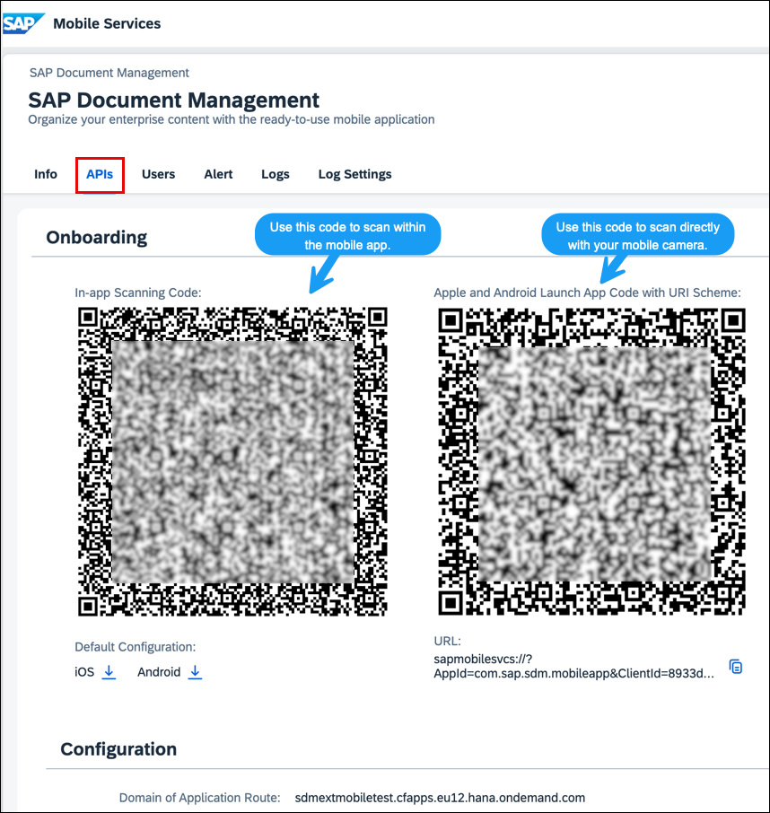

<!-- loio985ec468d7dc4dedb6a0ed583745e5cd -->

# Generating QR Code for Mobile Applications

The procedure outlines how to generate a QR code for activating the mobile application.

<a name="loio985ec468d7dc4dedb6a0ed583745e5cd__prereq_dg5_ycx_1bc"/>

## Prerequisites

-   You've subscribed to the service Document Management Service, Application Option in the SAP BTP cockpit. For more information about the initial setup, see [Subscribing to Document Management Service, Application Option](https://help.sap.com/docs/document-management-service/sap-document-management-service/subscribing-to-document-management-service-application-option?locale=en-US&version=Cloud).
-   You've added the **SDM\_MobileAdmin** role to your account.

## Procedure

1.  Log on to the Document Management Service, Application Option admin view.

2.  Click the *Document Management Service Mobile Admin* tile.

    

    You're navigating to the *Getting Started* page.

3.  On the Getting Started page, click *Start Onboarding*.

4.  Click *SAP Mobile Services* cockpit.

    The SAP Mobile Services cockpit is open in a separate window.

5.  Navigate to the *APIs* tab.

    The QR code has been displayed.

6.  Download and share any QR codes with users to whom you want to provide mobile access. They can then scan it with their phone and get access.

    There are two types of QR codes:

    -   In-app QR Code: It's used to scan within the mobile application.
    -   QR code with Link: Using the camera, scan this QR code. It automatically displays a link, leading you to the application.

    

**Related Information**  

[Security Policies](security-policies-9eb9176.md "You can manage your application's security settings through the SAP Mobile Services cockpit.")

