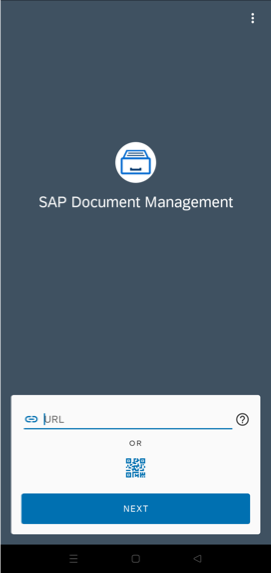

<!-- loio16623553fdb8487b8e09f265f1fce347 -->

<link rel="stylesheet" type="text/css" href="css/sap-icons.css"/>

# Installing the Android App

Before you can use the Document Management Service mobile app on your Android device, you've to set it up.

<a name="loio16623553fdb8487b8e09f265f1fce347__prereq_N10014_N10011_N10001"/>

## Prerequisites

-   Your Android has version 8.0 or higher installed.

-   You've enabled SAP Cloud Identity Services - Identity Authentication to log in to mobile clients. For more information, see [Configuring Identity Authentication In Document Management Service](configuring-identity-authentication-in-document-management-service-cf44481.md).

-   If you wish to use the QR code configuration, you already have the QR code generated for the server URL that you generated as part of the previous step.

<a name="loio16623553fdb8487b8e09f265f1fce347__steps_lvn_mht_5k"/>

## Procedure

1.  Download and install the Document Management Service app from Google Play. See [SAP Document Management Service app on Google Play](https://play.google.com/store/apps/details?id=com.sap.sdm.android).

2.  Start the app.

3.  Configure your account using a QR code.

    

    1.  On the Android device, choose  QR code scanner.

    2.  With the camera of the Android device, scan the QR code that is already available with you.

    3.  Click *OK* to confirm that you want to configure the URL supplied by the QR code.

    4.  Choose *Next*.

    You're directed to the user authentication log on screen.

4.  You can configure your account without a QR code by following sub steps:

    1.  Enter the Document Management Service server URL \(unless this field is prefilled\) supplied by your administrator.

    2.  Choose *Next*.

    3.  Authenticate the user by entering their credentials.

    4.  Choose *Log On*.

## Results

You're connected to Document Management Service.

**Related Information**  

[SAP Document Management Service app on Google Play](https://play.google.com/store/apps/details?id=com.sap.sdm.android)

