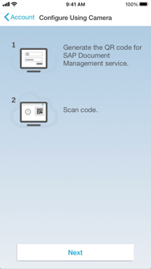

<!-- loioffe75ca24d7843138ae3d8bd8fd4e07a -->

# Installing the iPad or the iPhone App

Before you can use the Document Management Service mobile app on your iOS device, you've to set it up.

<a name="loioffe75ca24d7843138ae3d8bd8fd4e07a__prereq_N10014_N10011_N10001"/>

## Prerequisites

-   Your iOS device has version 12.0 or higher installed.

-   You've enabled SAP Cloud Identity Services - Identity Authentication to log in to mobile clients. For more information, see [Configuring Identity Authentication In Document Management Service](configuring-identity-authentication-in-document-management-service-cf44481.md).

-   If you wish to use the QR code configuration, you already have the QR code for the server URL you generated as part of the previous step.

## Procedure

1.  Download and install the Document Management Service app from the Apple AppStore. See [SAP Document Management Service app on Apple App Store](https://apps.apple.com/us/app/document-management-service/id1593443458).

2.  Start the app.

3.  Configure your account using a QR code.

    1.  On the iOS device, choose *Configure Using Camera*.

        

    2.  Read the instructions and choose *Next*.

        

    3.  With the camera of the iOS device, scan the QR code that is already available with you.

    4.  Click *OK* to confirm that you want to configure the URL supplied by the QR code.

    5.  Click *Yes*.

    You're directed to the user authentication log on screen.

4.  You can configure your account without a QR code by following sub steps:

    1.  Enter the Document Management Service server URL \(unless this field is prefilled\) supplied by your administrator.

    2.  Choose *Next*.

    3.  Authenticate the user by entering their credentials.

    4.  Choose *Log On*.

        -   If you're asked to set an app passcode to protect the data stored in the app, enter a passcode containing at least 8 characters.

            > ### Caution:  
            > If you forget your passcode, you've to reinstall the app. This means that you've to make your settings again and all synced documents are gone .

        -   If you aren't asked for an app passcode, you can set one within the app settings at a later point in time.

        If your administrator has enabled the use of fingerprints to unlock the app, you can configure Touch ID. Either you do this when setting a new passcode for the app or later on in the app settings.

## Results

You're connected to Document Management Service.

**Related Information**  

[SAP Document Management Service app on Apple App Store.](https://apps.apple.com/us/app/document-management-service/id1593443458)

