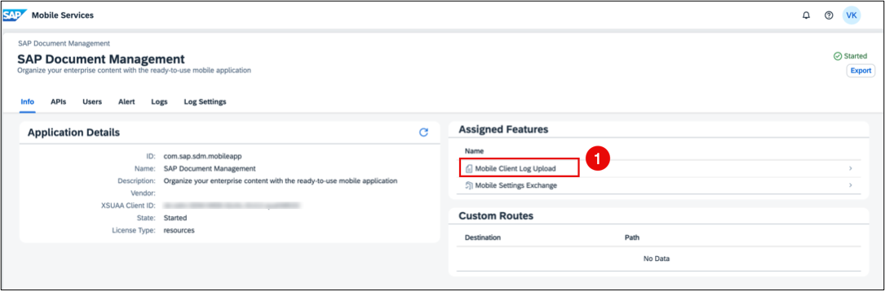
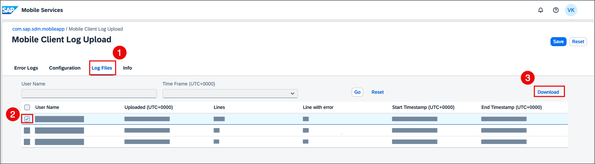

<!-- loiof075c959af68428d91657af815b8c281 -->

# Troubleshooting the Mobile App

Consider the following when troubleshooting errors that might occur in your mobile app.

<a name="loiof075c959af68428d91657af815b8c281__section_c1n_ylf_qbc"/>

## Getting Support

If you run into a technical issue when using the SAP Document Management mobile app, check whether it has been reported as a Known Issue on the support launchpad. If you can't find your issue, you can report your issue as follows.

### Prerequisites

-   You've enabled the log setting in your mobile application. See [User Menu](user-menu-b513500.md).
-   Your administrator has set the security policy for uploading logs in the SAP Mobile Services cockpit. See [Setting Up Security Policies](setting-up-security-policies-9eb9176.md).

### Procedure

1.  Open [SAP for Me](https://me.sap.com/home) and log on.
2.  Open the *Services & Support* dashboard.
3.  To check for existing solutions, use the *Knowledge Search* tab.

    The search covers:

    -   SAP Notes and KBAs

    -   SAP Community

    -   SAP Support Portal

    -   Product documentation

    -   Guided Answers

4.  Choose the *Get Support* on the *Overview*tab. In the dialog box that appears, choose *Report New Issue*.
5.  Enter the details of the issue, such as the subject and summary of the issue, description, and priority.
6.  When asked to specify the component, enter *BC-CP-CF-SDM-CLT-MOB*.
7.  Make sure to attach the log data with your request:
    1.  In the mobile app, go to *Support* \> *Activity Log* and click *Send Activity Log*.
    2.  Navigate to the *Document Management Service Mobile Application Onboarding* tile on the home page.
    3.  Select the*Mobile Service Cockpit*.
    4.  Under *Assigned Features*, select *Mobile Client Log Upload* .

        

    5.  Go to *Log Files* to see uploaded logs. Choose your file from the list and click *Download*.

        

8.  Once you've filled in all necessary fields, click *Submit*.

