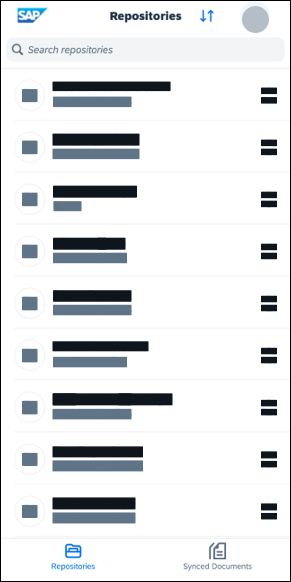

<!-- loioaf2245ecf72a40c084fe81a4d6346dfb -->

<link rel="stylesheet" type="text/css" href="css/sap-icons.css"/>

# Using Mobile Application

The following features are available on the home page of the SAP Document Management Service mobile application.

<a name="concept_zdl_xgd_bbc"/>

<!-- concept\_zdl\_xgd\_bbc -->

## Repositories

You can access the repositories that have been onboarded through your application UI once the activation has been successful.

<a name="concept_wkj_zgd_bbc"/>

<!-- concept\_wkj\_zgd\_bbc -->

## Synced Documents

Keep your documents up-to-date across devices with the Synced Documents feature on the mobile app.

In the *Synced Documents* folder, you can find a list of files that have been enabled for sync and are available for offline use. To enable sync, choose  More Options and choose *Sync*.

