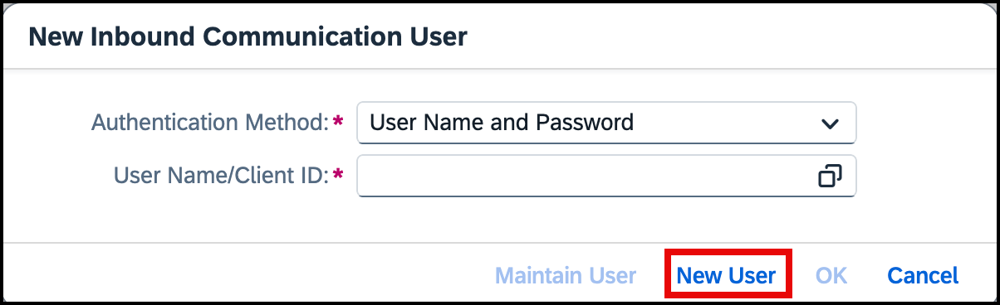

<!-- loiobb521d36b03448bd808ff0f0adac3567 -->

<link rel="stylesheet" type="text/css" href="css/sap-icons.css"/>

# Creating an Inbound Communication System

Create an inbound communication system to link to a communication arrangement.

<a name="loiobb521d36b03448bd808ff0f0adac3567__prereq_qyn_qtr_nbc"/>

## Prerequisites

-   You have admin access to the SAP S/4HANA Cloud system.

-   You've already created a Communication Arrangement. For more information, see [Setting Up Inbound Configuration Between SAP BTP and SAP S/4HANA Cloud](setting-up-inbound-configuration-between-sap-btp-and-sap-s-4hana-cloud-5aa38f2.md).

## Procedure

1.  Log on to the SAP Fiori launchpad \(SAP S/4HANA Cloud\).

2.  Search for the *Communication Arrangement* and select the *Arrangement Name* from the list.

3.  Navigate to *Common Data* section. To create a new communication system, choose *New*.

4.  The *New Communication System* dialog box is displayed. Enter the following details:

    -   *<System ID\>*: Enter the system ID. For example, `TEST_SAP_COM_0194`.

    -   *<System Name\>*: Enter a descriptive name for the system.

5.  Choose *Create*.

6.  Under the *General tab*, go to the *Technical Data* section and choose  check mark for the *Inbound Only* option.

7.  Scroll down to the section *User for Inbound Communication* and choose :heavy_plus_sign: to add new inbound user.

8.  In the *New Inbound Communication User* dialog box that appears, select *User Name and Password* as *Authentication Method*, and then choose *New User*.

    

9.  Under the *User Data*, enter the following details:

    -   User Name
    -   Description
    -   Password

10. Choose *Create* and choose *OK*.

    A success message is displayed, indicating that the inbound user has been added.

11. Choose *Save* at the bottom of the page to save the communication system.

