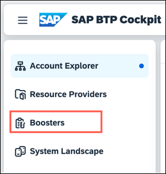
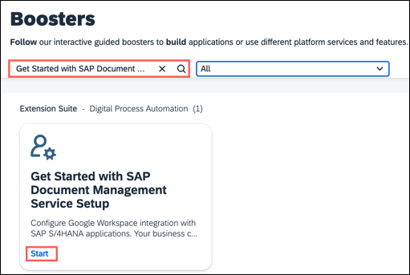
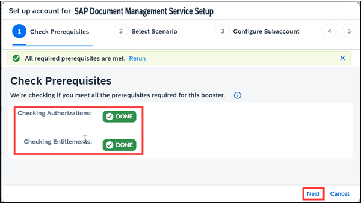
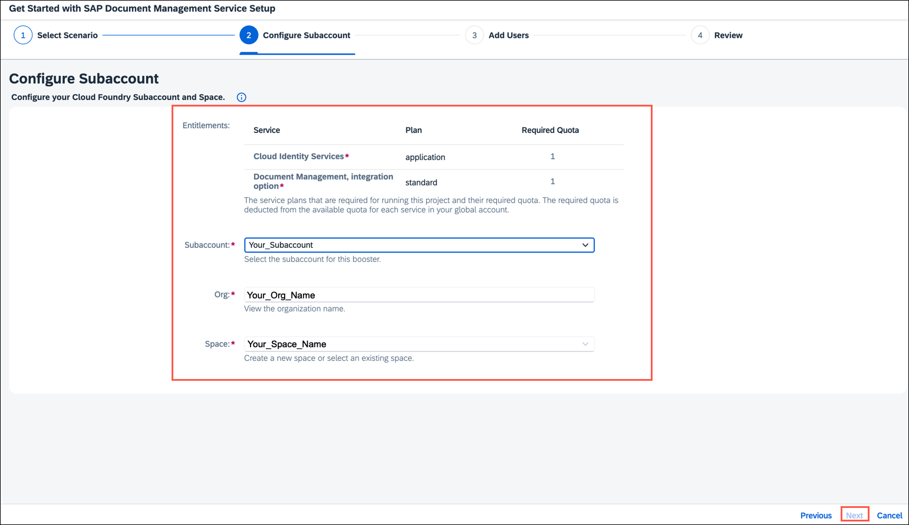
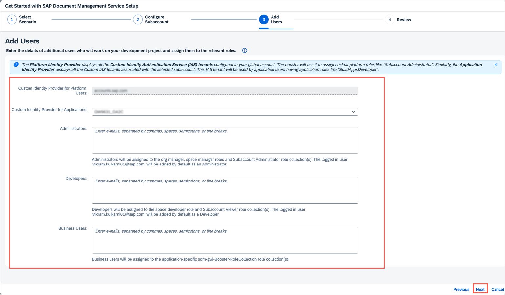
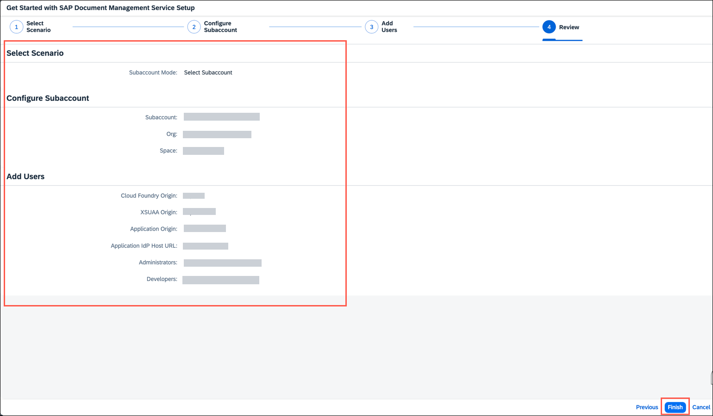
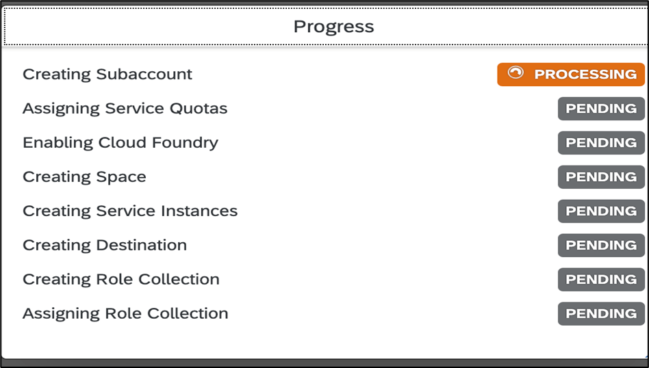

<!-- loioef912847cbb24bf8904e6e81c7e79067 -->

# Initial Setup

Before you get started in Document Management Service, Integration Option your SAP BTP account administrator must subscribe to your SAP BTP subaccount to the Document Management Service, Integration Option by performing some preparatory steps.

<a name="loioef912847cbb24bf8904e6e81c7e79067__prereq_z1h_ndy_w1c"/>

## Prerequisites

-   You've created a global account in the SAP BTP cockpit. See [Getting a Global Account](https://help.sap.com/docs/btp/sap-business-technology-platform/getting-global-account?version=Cloud).

-   You've added entitlements for Document Management Service, Integration Option \(Standard Plan\). For more information about entitlements, see [Configure Entitlements and Quotas for Subaccounts](https://help.sap.com/viewer/65de2977205c403bbc107264b8eccf4b/Cloud/en-US/5ba357b4fa1e4de4b9fcc4ae771609da.html).

-   You have admin access to an SAP BTP global account with Document Management Service, Integration Option.

<a name="loioef912847cbb24bf8904e6e81c7e79067__context_irl_kdy_w1c"/>

## Context

Once you have access to an SAP BTP global account, you can get access to Document Management Service, Integration Option through entitlements. You can use the booster to automatically perform the following steps:

-   Creating a subaccount \(if you selected that option\)
-   Assigning service quotas
-   Enabling Cloud Foundry
-   Subscribing to SaaS applications
-   Creating a space
-   Creating service instances
-   Creating a destination
-   Assigning role collection

To access Document Management Service, Integration Option, perform the following steps:

## Procedure

1.  From your SAP BTP cockpit, choose *Boosters*.

    

2.  Search for *Get Started with SAP Document Management Service Setup*, and choose *Start* to launch the booster directly.

    

    The booster loads and the prerequisite check run automatically. These prerequisite checks ensure that your user account has the necessary permissions to subscribe to new services and that your SAP BTP global account has available Document Management Service, Integration Option \(Standard Plan\) entitlements.

3.  Once the prerequisite checks are met, choose *Next*.

    

4.  In the *Select Scenario* step, select one of the following options depending on your authorization.

    -   *Create Subaccount*: Choose this option if your subaccount doesn't have an active subscription to Document Management Service, Integration Option. If you proceed with this step, in the *Configure Subaccount* step, select the necessary entitlements for the service and provide information for the required fields. See [Configure Entitlements and Quotas for Subaccounts](https://help.sap.com/docs/btp/sap-business-technology-platform/configure-entitlements-and-quotas-for-subaccounts?version=Cloud).
    -   *Select Subaccount*: Choose this option if your subaccount already has an active subscription to Document Management Service, Integration Option.

5.  Enter your *Subaccount Details*, including your chosen *Subaccount Name*, *Org Name*, and *Space Name*.

6.  Choose *Next*.

7.  In the *Add Users* step, follow the substeps:

    1.  Select your *Custom Identity Provider for Applications* from the dropdown menu or you can keep it default if there are no custom entries.

    2.  Enter the e-mail addresses of users who need access to your Document Management Service, Integration Option service instance, and then choose *Next*.

        **Administrators** are given admin rights within the SAP BTP space and subaccount, whereas **Developers** are given Document Management Service, Integration Option specific rights only.

        > ### Note:  
        > Your own user account is automatically assigned as an administrator, so you don't need to enter your details at this stage.

8.  Review your subaccount details, and then choose *Finish*.

    The booster now runs with the progress of each stage displayed.

    

9.  Once the booster has successfully run, a success message is displayed.

    > ### Note:  
    > A destination is created along with a few additional properties using this booster. The remaining properties need to be configured manually.
    > 
    > For more information about destination configuration, see [Creating HTTP Destinations](creating-http-destinations-2b04ac7.md).

**Related Information**  

[Setting Up a Google Workspace Account](setting-up-a-google-workspace-account-9670f69.md "Create your Google Workspace Account to connect to Document Management Service, Integration Option.")

[Creating HTTP Destinations](creating-http-destinations-2b04ac7.md "Create destinations in your SAP BTP subaccount to connect Google Drive with Document Management Service, Integration Option.")

[Managing Cross-Domain Mapping](managing-cross-domain-mapping-96d2d97.md "Manage cross-domain mapping if your domain is different from the Google Workspace domain.")

[Create a Repository Using the Onboarding API for Google Drive](create-a-repository-using-the-onboarding-api-for-google-drive-90faa8c.md "Create your repository to Document Management Service, Integration Option as it's required for establishing a connection with Google Drive.")

[Supporting CMIS APIs](supporting-cmis-apis-4288da6.md "Following is a list of all supported CMIS (Content Management Interoperability Services) REST APIs.")

[Establishing Trust Configuration Between SAP S/4HANA Cloud And SAP BTP](establishing-trust-configuration-between-sap-s-4hana-cloud-and-sap-btp-66f91a9.md "To establish SAML trust to the identity providers generated in the SAP S/4HANA Cloud, import the SAML identity provider metadata to the Cloud Foundry account.")

[Setting Up SAML Outbound OAuth Configuration Between SAP S/4HANA Cloud And SAP BTP](setting-up-saml-outbound-oauth-configuration-between-sap-s-4hana-cloud-and-sap-btp-26f9c07.md "Configure SAML Outbound OAuth configuration between SAP S/4HANA Cloud and SAP BTP.")

[Maintain Business Roles Within the SAP S/4HANA Cloud](maintain-business-roles-within-the-sap-s-4hana-cloud-091973b.md "Create and maintain business roles based on the selected business catalogs.")

[Establishing Trust Configuration Between SAP S/4HANA On-Premise And SAP BTP](establishing-trust-configuration-between-sap-s-4hana-on-premise-and-sap-btp-f64dcdb.md "To establish SAML trust to the identity providers generated in the SAP S/4HANA On-Premise, import the SAML identity provider metadata to the SAP BTP account.")

[Setting Up SAML Outbound OAuth Configuration Between SAP S/4HANA \(On Premise\) And SAP BTP](setting-up-saml-outbound-oauth-configuration-between-sap-s-4hana-on-premise-and-sap-btp-699a106.md "Configure SAML Outbound OAuth configuration between SAP S/4HANA (on premise) and SAP BTP.")

[Maintain Business Roles Within SAP S/4HANA \(On Premise\)](maintain-business-roles-within-sap-s-4hana-on-premise-d1999cf.md "You can define authorizations for your custom business roles in SAP S/4HANA (On Premise).")

[Restrictions](restrictions-ed62ee4.md "The following is a list of various restrictions provided by Google Drive APIs to support Google Workspace Integration.")

[Creating HTTP Destinations](creating-http-destinations-2b04ac7.md "Create destinations in your SAP BTP subaccount to connect Google Drive with Document Management Service, Integration Option.")

