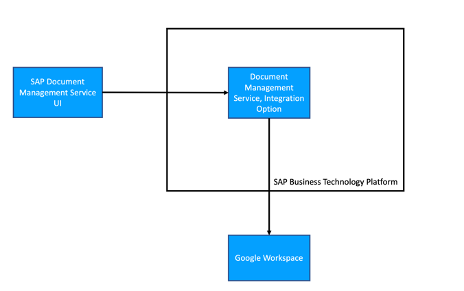
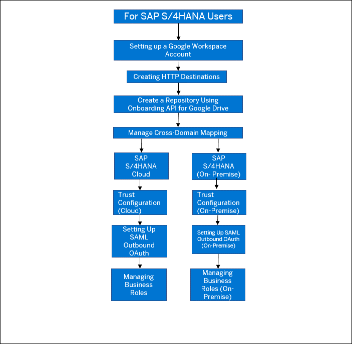

<!-- loio594bf95dbab64358aef97a73296b6054 -->

# Integrating SAP S/4HANA with Google Workspace Using SAP Document Management Service

Google Workspace includes Google Drive as one of its productivity applications. You can integrate Google Drive as a file share with SAP Document Management Service. Google documents can be opened in a web browser using Google UI. Create, read, update, and delete \(CRUD\) operations can be performed on your Google documents and folders through this integration.

Your businesses can use Google Drive integration with SAP Document Management Service to maximize their workflow efficiency and store their documents. For the integration between Google Drive and SAP Document Management Service, you need a Google Workspace account.

<a name="loio594bf95dbab64358aef97a73296b6054__section_by2_ckc_xvb"/>

## Supported Scenarios

The Google integration supports the following scenarios:

> ### Remember:  
> Google Drive can't be used as a CMIS-compliant content repository for SAP S/4HANA.

<table>
<tr>
<th valign="top">

Scenario

</th>
<th valign="top">

Details

</th>
</tr>
<tr>
<td valign="top">

Export to Google Workspace

</td>
<td valign="top">

Learn how to export tables as spreadsheets \(.xlsx files\) to a cloud drive. For more information, see [Export to Google Workspace](https://help.sap.com/docs/SAP_S4HANA_CLOUD/085edb30fb3d413da552832f3d5c01c0/b481bf1ef7f842afba54e5c9750c2490.html?version=2208.500).

</td>
</tr>
<tr>
<td valign="top">

Upload General Journal Entries in Google Workspace

</td>
<td valign="top">

Get started uploading journal entries to Google Workspace. For more information, see [Integration with Google Workspace](https://help.sap.com/docs/SAP_S4HANA_CLOUD/ee9ee0ca4c3942068ea584d2f929b5b1/1ac7c893310e4081beb7c0fcd344a879.html?version=2208.500).

</td>
</tr>
</table>

<a name="loio594bf95dbab64358aef97a73296b6054__section_ibf_sbx_fyb"/>

## Supported Versions

The following SAP S/4HANA version is required for the integration:

-   SAP S/4HANA Cloud, public edition 2208 and above.

-   SAP S/4HANA Cloud, private edition 2022 and above.

-   SAP S/4HANA 2022 and above.

It's, however, recommended that you check for supported versions of the corresponding S/4HANA application before you begin this integration.

**Related Information**  

[Integrating with SAP S/4HANA](integrating-with-sap-s-4hana-534d945.md "Document Management Service offers both Inbound and Outbound integration with SAP S/4HANA.")

[Integrating the ABAP Environment with SAP Document Management Service](integrating-the-abap-environment-with-sap-document-management-service-c54ce8b.md "You can integrate the ABAP environment of SAP Business Technology Platform with SAP Document Management Service to establish a communication scenario.")

