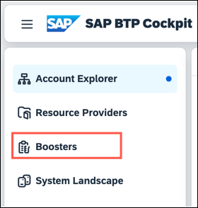
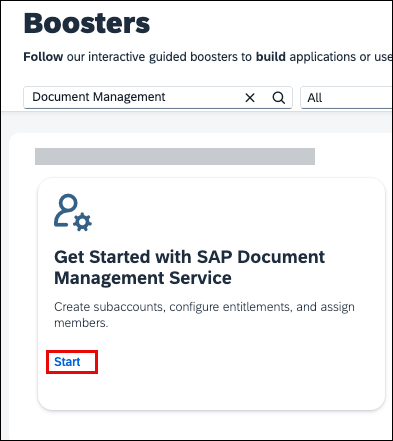

<!-- loioef912847cbb24bf8904e6e81c7e79067 -->

# Setup Using the Booster

Before you get started in Document Management Service, Integration Option your SAP BTP account administrator must subscribe to your SAP BTP subaccount to the Document Management Service, Integration Option by performing some preparatory steps.

<a name="loioef912847cbb24bf8904e6e81c7e79067__prereq_z1h_ndy_w1c"/>

## Prerequisites

-   You've created a global account in the SAP BTP cockpit. See [Getting a Global Account](https://help.sap.com/docs/btp/sap-business-technology-platform/getting-global-account?version=Cloud).

-   You've added entitlements for Document Management Service, Integration Option \(Standard Plan\). For more information about entitlements, see [Configure Entitlements and Quotas for Subaccounts](https://help.sap.com/viewer/65de2977205c403bbc107264b8eccf4b/Cloud/en-US/5ba357b4fa1e4de4b9fcc4ae771609da.html).

-   You have admin access to the SAP BTP global account with Document Management Service, Integration Option.

<a name="loioef912847cbb24bf8904e6e81c7e79067__context_irl_kdy_w1c"/>

## Context

Once you have access to an SAP BTP global account, you can get access to Document Management Service, Integration Option through entitlements. You can use the booster to automatically perform the following steps:

-   Checking authorizations
-   Creating a subaccount \(if you selected that option\)
-   Assigning Service Quotas
-   Enabling Cloud Foundry
-   Creating Space
-   Creating Service Instances
-   Creating Destination
-   Creating Role Collection
-   Assigning Role Collection

To access Document Management Service, Integration Option, perform the following steps:

## Procedure

1.  From your SAP BTP cockpit, choose *Boosters*.

    

2.  Search for *Get Started with SAP Document Management Service*, and choose *Start* to launch the booster directly.

    

    The booster loads and the prerequisite check run automatically. These prerequisite checks ensure that your user account has the necessary permissions to subscribe to new services and that your SAP BTP global account has available Document Management Service, Integration Option \(Standard Plan\) entitlements.

3.  Once the prerequisite checks are met, choose *Next*.

4.  In the *Select Repository* step, choose the following options based on your requirements.

    -   *Internal Repository*: Use an internally hosted repository within the Document Management Service's cloud repository.
    -   *External Repository*: Use this option if you intend to use Google Drive as a file share repository. For understanding the supported scenarios, refer to the topic [Integrating SAP S/4HANA with Google Workspace Using SAP Document Management Service](../integrating-sap-s-4hana-with-google-workspace-using-sap-document-management-service-594bf95.md).

5.  In the *Select Scenario* step, select one of the following options depending on your authorization.

    -   *Create Subaccount*: Choose this option if your subaccount doesn't have an active subscription to Document Management Service, Integration Option. If you proceed with this step, in the *Configure Subaccount* step, review the necessary entitlements for the service and provide information for the required fields. See [Configure Entitlements and Quotas for Subaccounts](https://help.sap.com/docs/btp/sap-business-technology-platform/configure-entitlements-and-quotas-for-subaccounts?version=Cloud).
    -   *Select Subaccount*: Choose this option if your subaccount already has an active subscription to Document Management Service, Integration Option.

6.  Enter your *Subaccount Details*, including your chosen *Subaccount Name*, *Org Name*, and *Space Name*.

7.  Choose *Next*.

8.  In the *Add Users* step, follow the substeps:

    1.  Select your *Custom Identity Provider for Applications* from the dropdown menu or you can keep it default if there are no custom entries.

    2.  Enter the e-mail addresses of users who need access to your Document Management Service, Integration Option service instance, and then choose *Next*.

        -   *Administrators* are assigned to the org manager and space manager roles, and the Subaccount Administrator role collections. The logged in user is added by default as an Administrator in the subaccount.
        -   *Developers* are assigned to the space developer role and Subaccount Viewer role collections. The logged in user is added by default as a Developer in the subaccount.
        -   *Business Users* are assigned to the application-specific `DocumentManagement-RoleCollection` that includes ***SDM\_Admin***, ***SDM\_BusinessAdmin***, ***SDM\_MigrationAdmin***, ***SDM\_User***, and ***Token\_Exchange***.

        > ### Note:  
        > -   Your own account is automatically assigned as an administrator, so you don't need to enter your details at this stage.
        > 
        > -   *Business Users* have all the administrative privileges for the application. They're required to assign relevant roles to the application-specific users.

9.  Review your submitted details, and then choose *Finish*.

    The booster now runs with the progress of each stage displayed.

10. Once the booster has successfully run, a success message is displayed.

    > ### Note:  
    > If an external repository is selected, a destination \( named `sdm-di-destination`\) is created with some additional properties using this booster. The remaining properties must be configured manually.
    > 
    > For more information about destination configuration, see [Creating HTTP Destinations](../creating-http-destinations-2b04ac7.md).

**Related Information**  

[Creating HTTP Destinations](../creating-http-destinations-2b04ac7.md "Create destinations in your SAP BTP subaccount to connect Google Drive with Document Management Service, Integration Option.")

