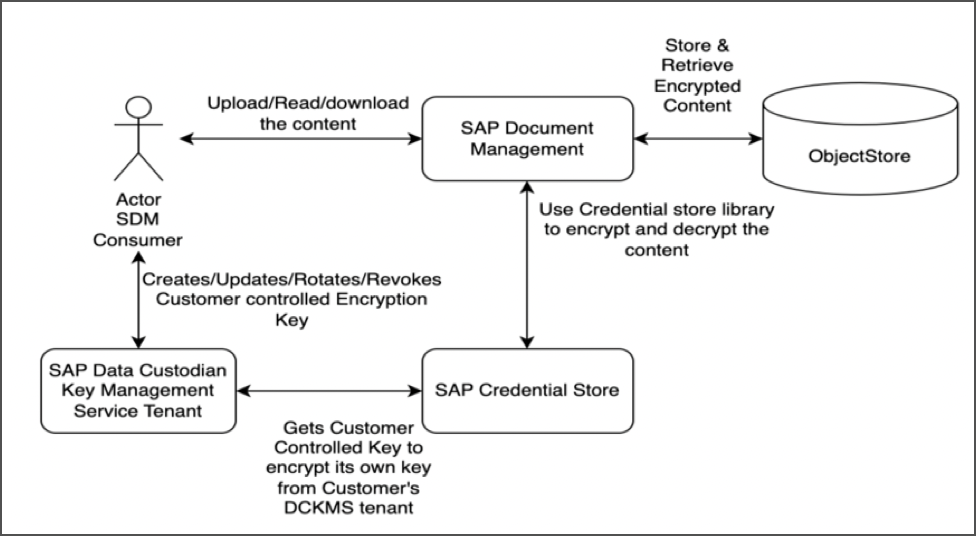

<!-- loio6ec11222001540b58de83e077837a303 -->

# Encryption

Document Management Service encryption adds an additional layer of security beyond traditional permissions for your files and folders.

The feature allows you to encrypt data stored in your documents. The encryption prevents unauthorized access and malicious interference.

The available options of encryption in Document Management Service are as follows:

-   **Default encryption:** You can have default encryption based on a customer-managed key managed by the SAP Credential Store. In this option, the system uses a default encryption key to generate and encrypt documents. The encryption key is stored in the Credential Store and used when documents are encrypted. The key is managed by Document Management Service in integration with SAP Credential Store. For more information, see [Default Encryption via SAP Credential Store](default-encryption-via-sap-credential-store-b978a4d.md).

-   **Encryption through DCKMS:** If you want to manage and regulate the encryption from your side then you need to have SAP Data Custodian Key Management Service \(DCKMS\) tenant configured. DCKMS provides an independent and secure repository for encryption keys. It allows you to control and manage encryption keys in your own environment, rather than relying on default keys. For more information, see [Support for Encryption Key Using DCKMS Setup](support-for-encryption-key-using-dckms-setup-235a59b.md) .

In the following block diagram, you can see how encryptions are used with SAP Document Management Service:

<a name="loio6ec11222001540b58de83e077837a303__section_g5y_msw_rxb"/>

## Limitations

-   Encryption isn't supported for the existing repositories.

-   Encryption doesn't apply to the folder per tenant consumption models.

-   For encrypted repositories, append content stream and chunk uploads are not supported.

**Related Information**  

[Frequently Asked Questions \(FAQ\)](frequently-asked-questions-faq-30f1046.md "You can find a collection of frequently asked questions and provided solutions.")

