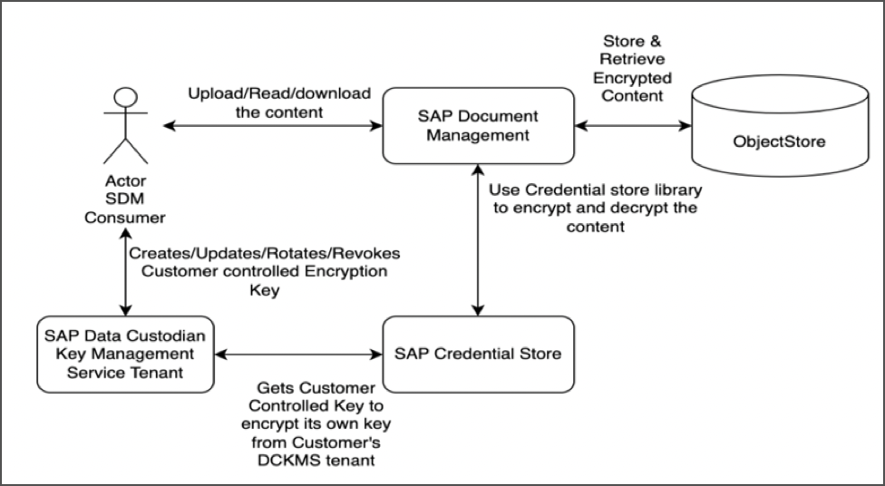

<!-- loio6ec11222001540b58de83e077837a303 -->

# Encryption via Managed Keys

Document Management Service encryption adds an additional layer of security beyond traditional permissions for your files and folders.

> ### Caution:  
> This is a sensitive feature that should be used with utmost caution, as any misuse could potentially lead to data inconsistencies. Before enabling the encryption feature, please ensure you fully understand its functionality and implications. If you encounter any queries or issues, promptly raise a medium-priority incident through component *BC-CP-CF-SDM-INT*. Don't proceed with enabling the feature until your concerns are thoroughly addressed. For additional clarity, please refer to the [Frequently Asked Questions \(FAQ\)](frequently-asked-questions-faq-30f1046.md).

The feature allows you to encrypt data stored in your documents. The encryption prevents unauthorized access and malicious interference.

The available options for encryption in the Document Management Service are as follows:

-   **SAP-Managed Key Encryption:** You can have default encryption based on a customer-managed key managed by the SAP Credential Store. In this option, the system uses a default encryption key to generate and encrypt documents. The encryption key is stored in the Credential Store and used when documents are encrypted. The key is managed by Document Management Service in integration with SAP Credential Store. For more information, see [SAP-Managed Key Encryption](sap-managed-key-encryption-b978a4d.md).

-   **Customer-Managed Key Encryption via DCKMS:** If you want to manage and regulate the encryption from your side then you need to have SAP Data Custodian Key Management Service \(DCKMS\) tenant configured. DCKMS provides an independent and secure repository for encryption keys. It allows you to control and manage encryption keys in your own environment, rather than relying on default keys. For more information, see [Customer-Managed Key Encryption via DCKMS](customer-managed-key-encryption-via-dckms-235a59b.md) .

In the following block diagram, you can see how encryptions are used with SAP Document Management Service:

<a name="loio6ec11222001540b58de83e077837a303__section_g5y_msw_rxb"/>

## Limitations

-   Encryption isn't supported for the existing repositories.

-   Encryption doesn't apply to the folder per tenant consumption model.

**Related Information**  

[Frequently Asked Questions \(FAQ\)](frequently-asked-questions-faq-30f1046.md "You can find a collection of frequently asked questions and provided solutions.")

