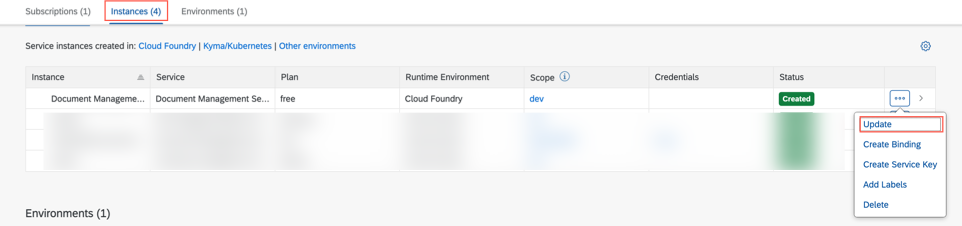

<!-- loio944c578bd8c7453db2e8e0e60804709c -->

# Service Plans

Learn more about the different types of service plans for SAP Document Management Service.

SAP Document Management Service provides different types of application plans. The type you choose determines pricing, conditions of use, resources, available services, and hosts.

It depends on your use case whether you choose a free plan or a paid standard plan. If you plan to use your global account in productive mode, you must purchase a paid enterprise account. It's important that you're aware of the differences when you're planning and setting up your account model.

To use the SAP Document Management Service, first you need to create a service instance in the SAP Business Technology Platform cockpit. There are two plans available: free and standard. You can select either the free plan, or the standard plan. Both the plans are available only in the enterprise accounts.

If you selected the free plan and want to upgrade to the standard plan, you can do so as described in [Upgrading to the Standard Plan](service-plans-944c578.md#loio944c578bd8c7453db2e8e0e60804709c__section_dzc_j1z_tpb).

For more details about the plans, see the following table:

<table>
<tr>
<th valign="top">

Service Plan

</th>
<th valign="top">

Details

</th>
<th valign="top">

Supported Options

</th>
<th valign="top">

Account Type

</th>
</tr>
<tr>
<td valign="top">

Free

</td>
<td valign="top">

-   Plan with basic functionality and relaxed security, excellent for development and try-out purposes.

-   1-GB data storage.

-   1000 API calls.

-   Region

    -   **AWS**: Australia \(Sydney\), Brazil \(São Paulo\), Canada \(Montreal\), Europe \(Frankfurt\), Japan \(Tokyo\), Singapore, South Korea \(Seoul\), US East \(VA\).
    -   **Microsoft Azure:** Europe \(Netherlands\), Japan \(Tokyo\), Singapore, US East \(VA\), US West \(WA\).

</td>
<td valign="top">

-   Document Management Service, Integration Option

-   Document Management Service, Repository Option

</td>
<td valign="top">

Enterprise

</td>
</tr>
<tr>
<td valign="top">

Standard

</td>
<td valign="top">

-   Default plan with all the standard features.

-   Excellent for productive usage.

-   100-GB data storage.

-   API access is available with API calls in blocks of 50000.

-   Region

    -   **AWS**: Australia \(Sydney\), Brazil \(São Paulo\), Canada \(Montreal\), Europe \(Frankfurt\), Japan \(Tokyo\), Singapore, South Korea \(Seoul\), US East \(VA\)
    -   **Microsoft Azure:** Europe \(Netherlands\), Japan \(Tokyo\), Singapore, US East \(VA\), US West \(WA\).

    -   **Google Cloud:** Europe \(Frankfurt\), US Central \(IA\)

</td>
<td valign="top">

-   Document Management Service, Integration Option

-   Document Management Service, Application Option
-   Document Management Service, Repository Option

</td>
<td valign="top">

Enterprise

</td>
</tr>
</table>

<a name="loio944c578bd8c7453db2e8e0e60804709c__section_xww_n3y_ztb"/>

## Free Plan Restrictions

> ### Remember:  
> Only community support is available for free service plans and these aren't subject to SLAs. Use of free tier service plans are subject to additional terms and conditions as provided in the[SAP Business Technology Platform Supplement](https://www.sap.com/about/trust-center/agreements/cloud/cloud-services.html?sort=latest_desc&search=Supplement+Business+Technology+Platform&tag=language:english&pdf-asset=2e6cceab-fe7d-0010-bca6-c68f7e60039b&page=1).

-   Free Tier provides an option to try out the features offered by different flavors of Document Management services \(Integration, Repository, and Application options\). Trying out features related to connectivity of this service with external repositories \(OpenText and any other external storage server\) and usage of the Document Management Service, Repository Option as storage with SAP S/4 HANA, you may need to use more API calls, thus restricting the usage of the free tier. For exploring more options, we recommend trying out the standard plan.

-   For Document Management Service, integration option, a free plan is offered at the instance level, and for Document Management Service, Repository Option, a free plan is offered at the account level.
-   If both a free and a standard plan are assigned to a Document Management Service, Repository Option, the standard plan is considered.
-   If you first activated the free service plan, you can upgrade to the standard plan using the same free plan in a subaccount.

<a name="loio944c578bd8c7453db2e8e0e60804709c__section_dzc_j1z_tpb"/>

## Upgrading to the Standard Plan

To upgrade the application subscription from the free plan to the standard plan:

1.  Open your global account in the cockpit.
2.  Go to your subaccount.
3.  In the navigation area, choose *Instances and Subscriptions*.
4.  In the *Instances* tab, search for Document Management Service, Integration Option.
5.  Select the ellipsis at the end of the service instances row, and from the menu, select *Update*.

    

6.  In the wizard that opens, under the drop-down menu of the *Plan* field, select *standard*.
7.  Choose *Update Instance*.

