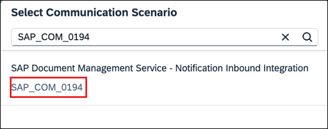
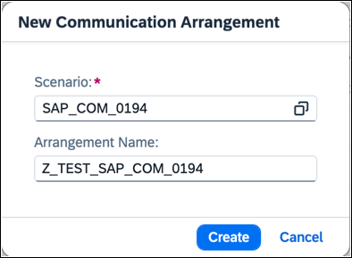

<!-- loio5aa38f2e1d6b463c887eff771e19594d -->

# Setting Up Inbound Configuration Between SAP BTP and SAP S/4HANA Cloud

Configure Inbound configuration between SAP BTP and SAP S/4HANA Cloud.

<a name="loio5aa38f2e1d6b463c887eff771e19594d__prereq_c33_2sr_nbc"/>

## Prerequisites

You have admin access to the SAP S/4HANA Cloud system.

## Procedure

1.  Log on to the SAP Fiori launchpad \(SAP S/4HANA Cloud\).

2.  Search for the *Communication Arrangements* app from the SAP Fiori launchpad.

3.  Choose *New*.

4.  Select the communication scenario `SAP_COM_0194`.

    

5.  Enter a name for the arrangement in *Arrangement Name*. For example, `Z_TEST_SAP_COM_0194`.

    

6.  Choose *Create*.

    Communication Arrangement has been created, and you're directed to the communication arrangement page to configure further settings.

7.  In the *Additional Properties* section, maintain the following details:

    <table>
    <tr>
    <th valign="top">

    Property Name
    
    </th>
    <th valign="top">

    Property Value
    
    </th>
    </tr>
    <tr>
    <td valign="top">
    
    *<File Share ID\>*
    
    </td>
    <td valign="top">
    
    `ZTEST`
    
    </td>
    </tr>
    <tr>
    <td valign="top">
    
    *<File Share Inbound Destination\>*
    
    </td>
    <td valign="top">
    
    Enter a custom value. You can use a format like `{SYSTEM_ID}_{CLIENT}`. For example, `ETX_200` for the system *ETX* and client *200*.
    
    </td>
    </tr>
    </table>
    
8.  Choose *Save*.

    The success message appears once the activation is complete.

**Related Information**  

[Setting Up a Google Workspace Account](setting-up-a-google-workspace-account-9670f69.md "Create your Google Workspace Account to connect to Document Management Service, Integration Option.")

[Creating HTTP Destinations](creating-http-destinations-2b04ac7.md "Create destinations in your SAP BTP subaccount to connect Google Drive with Document Management Service, Integration Option.")

[Managing Cross-Domain Mapping](managing-cross-domain-mapping-96d2d97.md "Manage cross-domain mapping if your domain is different from the Google Workspace domain.")

[Create a Repository Using the Onboarding API for Google Drive](create-a-repository-using-the-onboarding-api-for-google-drive-90faa8c.md "Create your repository to Document Management Service, Integration Option as it's required for establishing a connection with Google Drive.")

[Supporting CMIS APIs](supporting-cmis-apis-4288da6.md "Following is a list of all supported CMIS (Content Management Interoperability Services) REST APIs.")

[Establishing Trust Configuration Between SAP S/4HANA Cloud And SAP BTP](establishing-trust-configuration-between-sap-s-4hana-cloud-and-sap-btp-66f91a9.md "To establish SAML trust to the identity providers generated in the SAP S/4HANA Cloud, import the SAML identity provider metadata to the Cloud Foundry account.")

[Setting Up Outbound OAuth Configuration Between SAP BTP and SAP S/4HANA Cloud](setting-up-outbound-oauth-configuration-between-sap-btp-and-sap-s-4hana-cloud-26f9c07.md "Configure SAML Outbound OAuth configuration between SAP BTP and SAP S/4HANA Cloud.")

[Maintain Business Roles Within the SAP S/4HANA Cloud](maintain-business-roles-within-the-sap-s-4hana-cloud-091973b.md "Create and maintain business roles based on the selected business catalogs.")

[Establishing Trust Configuration Between SAP S/4HANA On-Premise And SAP BTP](establishing-trust-configuration-between-sap-s-4hana-on-premise-and-sap-btp-f64dcdb.md "To establish SAML trust to the identity providers generated in the SAP S/4HANA On-Premise, import the SAML identity provider metadata to the SAP BTP account.")

[Setting Up SAML Outbound OAuth Configuration Between SAP S/4HANA \(On Premise\) And SAP BTP](setting-up-saml-outbound-oauth-configuration-between-sap-s-4hana-on-premise-and-sap-btp-699a106.md "Configure SAML Outbound OAuth configuration between SAP S/4HANA (on premise) and SAP BTP.")

[Maintain Business Roles Within SAP S/4HANA \(On Premise\)](maintain-business-roles-within-sap-s-4hana-on-premise-d1999cf.md "You can define authorizations for your custom business roles in SAP S/4HANA (On Premise).")

[Restrictions](restrictions-ed62ee4.md "The following is a list of various restrictions provided by Google Drive APIs to support Google Workspace Integration.")

